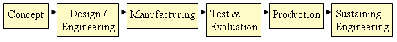

### Theory

**3D Scanning**

What is 3D scanning : In the most general terms, 3D scanning, also referred to as 3D digitizing, is the utilization of a three dimensional data acquisition device to acquire a multitude of X,Y,Z coordinates on the surface of a physical object. Each discrete X,Y,Z coordinate is referred to as a point. The conglomeration of all these points is referred to as a "point cloud". Typical format's for point cloud data are either an ASCII text file containing the X,Y,Z values for each point or a polygonal mesh representation of the point cloud in what is known as an STL file format.

Why 3D scanning: There is a wide range of 3D scanning technologies available to address a multitude of different applications ranging in size from an individual tooth to one of our national monuments. For this discussion we will confine our scanning parameters to product development / manufacturers.
There have been many studies that have shown that the company that delivers a product 1st to market captures the lion share of the revenue. With this goal in mind, product development / manufacturing companies are implementing 3D scanning solutions in an effort to reduce the time and costs associated with their Concept through Sustaining Engineering Product Life Cycle. There are many different points of entry in this product life cycle where an accurate As Built digital definition can add value

Key capabilities of the 3D scanning solution will be its ability to effectively capture an as thorough as required digital definition of the part / assembly with the required accuracy and data clarity to support the required deliverable. I highlight "as thorough as required" and "required accuracy and data clarity" because in some processes, not every downstream deliverable will require a complete scan or the same data accuracy.
Through our industry engagements we have seen many companies promised scanning capabilities, data accuracy, system flexibility and ease of downstream deliverables. For those of you who are users of 3D scanning solutions, you already know that the devil is in the details.
In 3-D scanning a real world object is taken to collect data on its shape and possibly its appearance (i.e. colour). The collected data can then be used to construct digital, three dimensional models useful for a wide variety of applications. Common applications of this technology include industrial design, reverse engineering and prototyping, quality control/inspection and documentation of cultural artefacts.
Many different technologies can be used to build these 3D scanning devices or 3D scanners. There are mainly 2 ways in which 3D scanning can be done, one is using a continuous contact scanner and the other is to use a non contact type of scanner(laser scanner, white light scanner), each technology comes with its own limitations, advantages and costs.

**Continuous contact scanner**

Contact 3D scanners probe the subject through physical touch. A CMM (coordinate measuring machine) is an example of a contact 3D scanner. It is used mostly in manufacturing and can be very precise. The disadvantage of CMMs though, is that it requires contact with the object being scanned. Thus, the act of scanning the object might modify or damage it.It is not that much accurate compared to non contact type. This fact is very significant when scanning delicate or valuable objects such as historical artefacts. The other disadvantage of CMMs is that they are relatively slow compared to the other scanning methods. Physically moving the arm that the probe is mounted on can be very slow. The advantage of this type of scanner is it's cheap compared to non contact type scanner.

**Non contact 3D scanner**

This type of scanners emits some kind of radiation or light and detects its reflection using a camera in order to probe an object. Possible types of emissions used include light, laser or x-ray.
The purpose of a 3D scanner is usually to create a point cloud of geometric samples on the surface of the object. Point cloud is a large amount of data in the form of a cluster of points, containing the co-ordinates(x,y,z) of every single point of each surface of the object. Usually a point cloud data will contain lacs of points. These points are used to generate a 3D model of the object using some software.
For most situations, a single scan will not produce a complete model of the subject. For example a laser scanner will at a time scan only one line of the object which will have 1or 2 mm thickness, then the position of the scanner is incremented by one step and the next line is scanned . Each line scanned will have a lot of points which will be separated by a certain pitch distance depending on the resolution of the camera picking the reflected laser from the object. But a 30Hz camera can take 30 images per second, the process very fast. Multiple scans, even hundreds, from many different directions are usually required to obtain information about all sides of the subject. These scans have to be brought in a common reference system, a process that is usually called alignment and then merged to create a complete model. For this a process known as triangulation is commonly used.
Both continuous contact and non contact type of scanner give point cloud data which will contain a lot of noise (noise consist of errors, overlapping of points, unwanted data, etc.) . So after getting the point cloud data, a noise reduction process should be done using some special software to get an organized data. It is only then that this data could be converted into a surface or solid model whichever is required by the user.

**Benefits of 3D scanning**

3D model scanning could benefit the design process if:
* Increase effectiveness working with complex parts and shapes.
* Help with design of products to accommodate someone else's part. If CAD models are outdated,
* a 3D scan will provide an updated version
* Replacement of missing or older parts

**Application**

Entertainment: 3D scanners are used by the entertainment industry to create digital 3D models for both movies and video games. In cases where a real-world equivalent of a model exists, it is much faster to scan the real-world object than to manually create a model using 3D modelling software. Frequently, artists sculpt physical models of what they want and scan them into digital form rather than directly creating digital models on a computer.

**Reverse engineering:**

A 3D scanner can be used to digitize free-form or gradually changing shaped components as well as prismatic geometries whereas a coordinate measuring machine is usually used only to determine simple dimensions of a highly prismatic model. These data points are then processed to create a usable digital model, usually using specialized reverse engineering software

**Cultural Heritage:**

There have been many research projects undertaken via the scanning of historical sites and artefacts both for documentation and analysis purposes.The combined use of 3D scanning and 3D printing technologies allows the replication of real objects without the use of traditional plaster casting techniques, that in many cases can be too invasive for being performed on precious or delicate cultural heritage artefacts

**Medical CAD/CAM:**

3D scanners are used in order to capture the 3D shape of a patient in orthotics and dentistry. It gradually supplants tedious plaster cast. CAD/CAM software are then used to design and manufacture the orthosis, prosthesis or dental implants.
Many Chairside dental CAD/CAM systems and Dental Laboratory CAD/CAM systems use 3D Scanner technologies to capture the 3D surface of a dental preparation (either in vivo or in vitro), in order to produce a restoration digitally using CAD software and ultimately produce the final restoration using a CAM technology (such as a CNC milling machine, or 3D printer). The chairside systems are designed to facilitate the 3D scanning of a preparation in vivo and produce the restoration

[Reference Link Here - https://youtu.be/SWjd4r2Yzvs](https://youtu.be/SWjd4r2Yzvs)